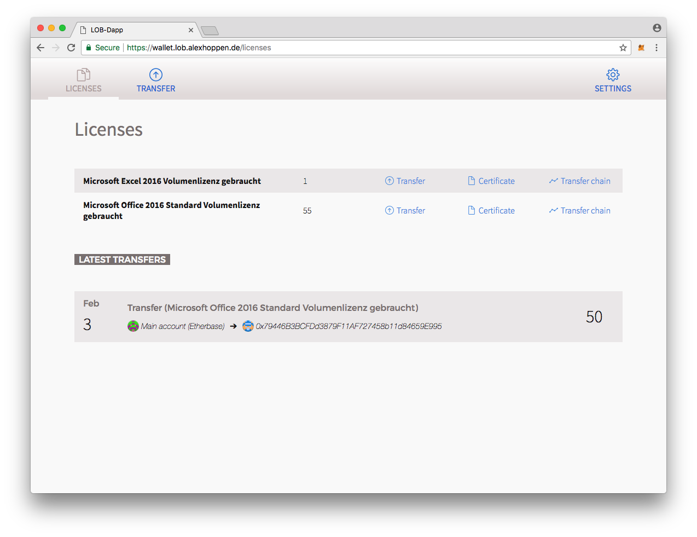
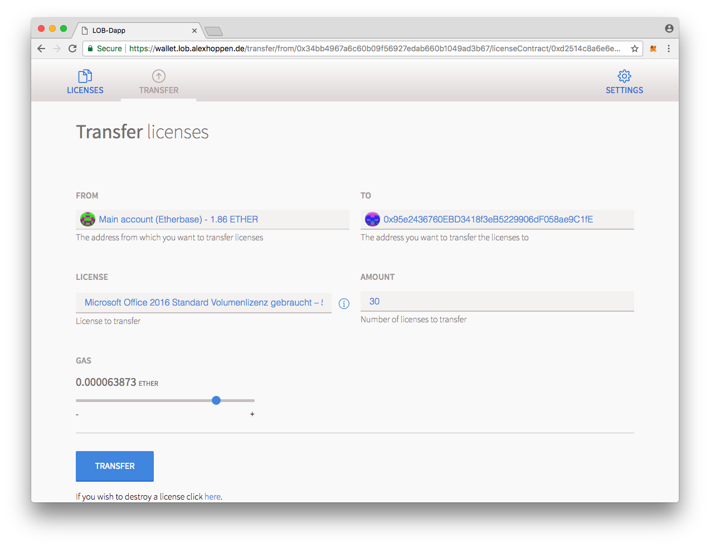
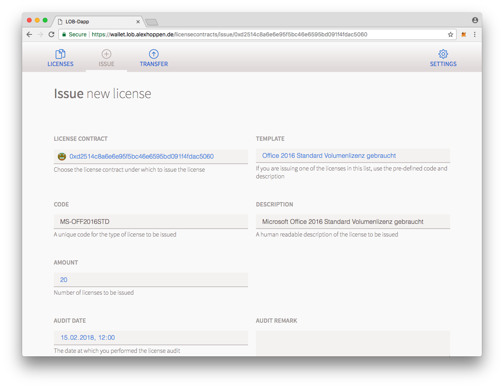

# License on Blockchain – Ðapp

This is the Dapp frontend to interact with the License on Blockchain [smart contracts](https://github.com/licence-on-blockchain/smart-contracts).

In the standard configuration, the wallet allows the management of LOB licenses owned by an address.





To register as a issuer, enable the issuer actions under Settings.

 

## Browser support

The wallet should run in any modern browser with a web3 interface (e.g. through [MetaMask](https://metamask.io) or [Mist](https://github.com/ethereum/mist)). We actively maintain the following browsers:

- Google Chrome with MetaMask installed
- Firefox with MetaMask installed
- Mist

## Build locally

To run the Dapp locally, you need [Meteor](https://www.meteor.com/install).

Run the following command from the repository's root to install the wallet's dependency. 

```
meteor npm install
``` 

Afterwards start a local development web server using the following command and open [http://localhost:3000](http://localhost:3000) in your browser.

```
meteor
```

## Build for distribution

To build the Dapp for distribution, install [meteor-build-client](https://github.com/frozeman/meteor-build-client) and run `build.sh`.